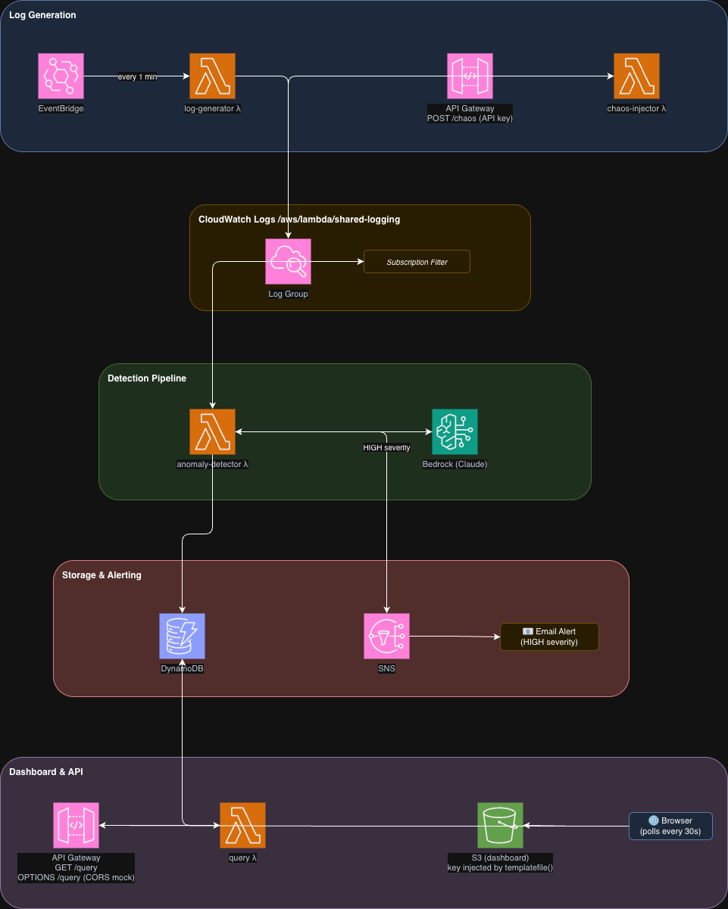

# Serverless Log Anomaly Detector

A serverless AWS project that simulates realistic HTTP access logs, injects anomalous traffic patterns, detects anomalies in real time using Bedrock (Claude), and alerts via SNS. See [ARCHITECTURE.md](ARCHITECTURE.md) for a full system overview.

## Diagram


## Prerequisites

- Go 1.21+
- Terraform >= 1.14
- AWS CLI, configured with credentials for your target account
- AWS account with Bedrock access enabled for `anthropic.claude-opus-4-5-20251101-v1:0` in `ca-west-1`

## Build

Compile all four Lambda binaries and package them as zip files:

```sh
make build
```

Output zips are written to `dist/`.

## Deploy

### 1. Create a `terraform.tfvars` file

```hcl
db_table     = "classified_logs"
alerts_email = "you@example.com"
```

`alerts_email` receives SNS notifications for HIGH severity anomalies. You will get a confirmation email from AWS — you must click the link before alerts will be delivered.

### 2. Apply

```sh
terraform init
terraform apply
```

After apply, note the outputs:

```sh
terraform output dashboard_url   # S3 static dashboard
terraform output chaos_endpoint  # POST to inject anomalies
terraform output -raw api_key    # API key for authenticated endpoints
```

## Running the Demo

### 1. Open the dashboard

Navigate to the `dashboard_url` output in a browser. It polls `GET /query` every 30 seconds and displays detected anomalies.

### 2. Inject chaos

```sh
curl -X POST https://<chaos_endpoint> \
  -H "x-api-key: <api_key>" \
  -H "Content-Type: application/json" \
  -d '{"duration_seconds": 60, "anomaly_type": "500_spike"}'
```

Available `anomaly_type` values: `500_spike`, `auth_failure`, `latency`.

### 3. Watch for results

Within ~60 seconds:
- An anomaly record appears in DynamoDB and on the dashboard
- If severity is HIGH, an alert email arrives from SNS

## Running E2E Tests

The e2e tests hit real AWS services. They require `AWS_ACCOUNT_ID` to be set (gates the entire suite) and `QUERY_ENDPOINT`/`API_KEY` for the HTTP endpoint tests (skipped individually if not set).

```sh
AWS_ACCOUNT_ID=$(aws sts get-caller-identity --query Account --output text) \
QUERY_ENDPOINT=$(terraform output -raw query_endpoint) \
API_KEY=$(terraform output -raw api_key) \
go test ./e2e/ -v
```

## Teardown

```sh
terraform destroy
```
